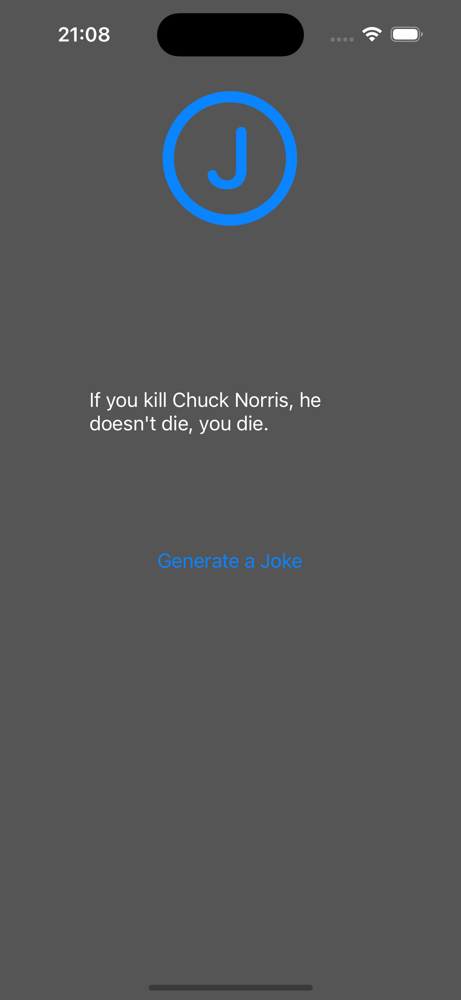

# Chuck Norris Jokes

This app was created using Swift and Storyboard. The reason was to study concepts like MVVM and API integration.

# Screen

<table>
  <tr>
    <td>
      
    </td>
  <tr>
</table>
